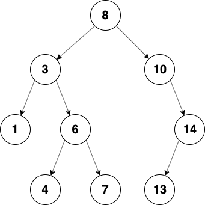
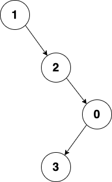

# Maximum Difference Between Node and Ancestor

## Description

Given the `root` of a binary tree, find the maximum value `V` for which there exist **different** nodes `A` and `B` where `V = |A.val - B.val|` and `A` is an ancestor of `B`.

A node `A` is an ancestor of B if either: any child of A is equal to B, or any child of A is an ancestor of B.

### Constraints

- The number of nodes in the tree is in the range `[2, 5000]`.
- 0 <= Node.val <= 10<sup>5<sup>

## Examples

### Example 1



```
Input: root = [8,3,10,1,6,null,14,null,null,4,7,13]
Output: 7
Explanation: We have various ancestor-node differences, some of which are given below :
|8 - 3| = 5
|3 - 7| = 4
|8 - 1| = 7
|10 - 13| = 3
Among all possible differences, the maximum value of 7 is obtained by |8 - 1| = 7.
```

### Example 2



```
Input: root = [1,null,2,null,0,3]
Output: 3
```